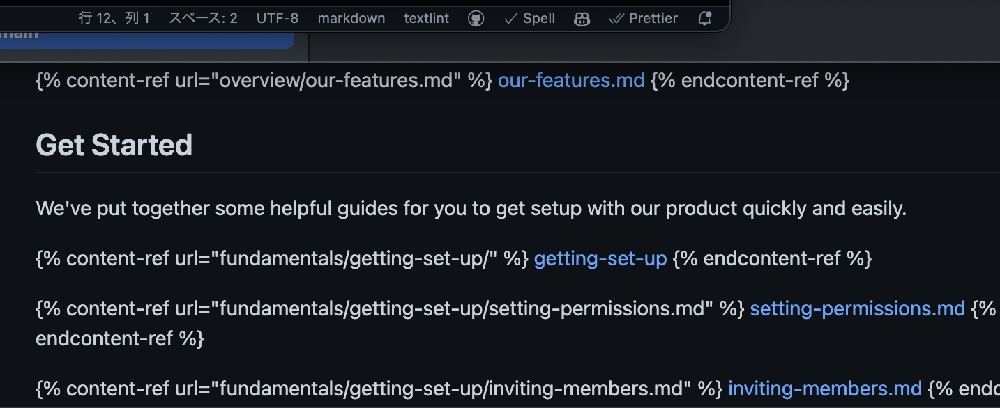
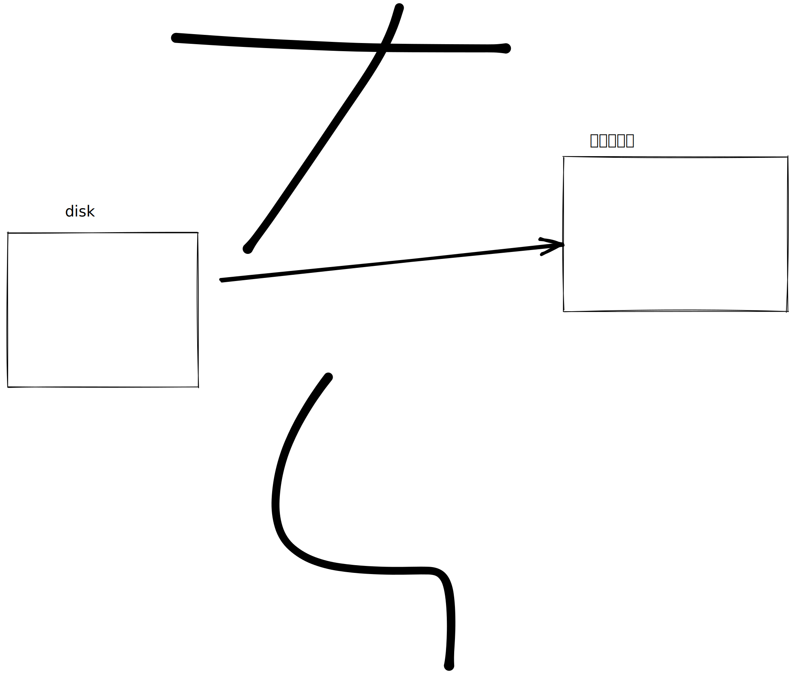
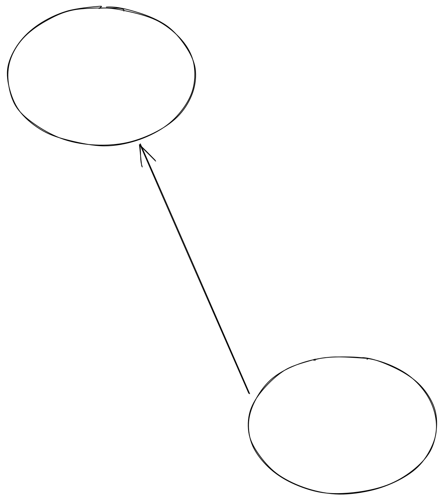
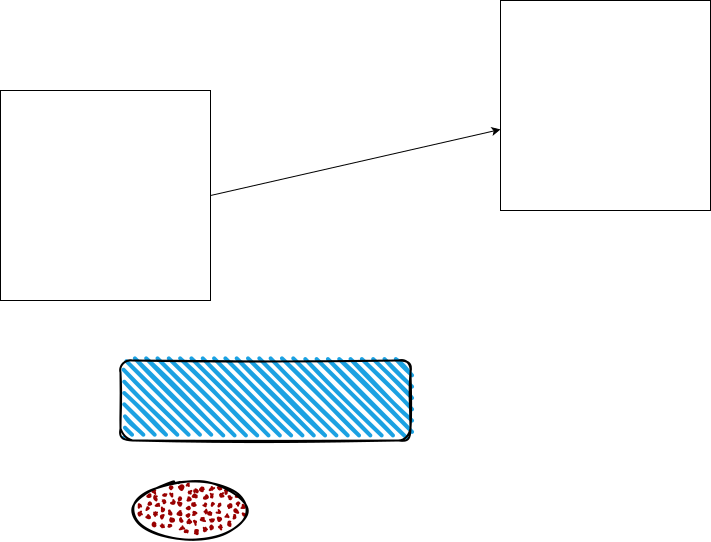

# 👋 Welcome to A Product

 


**GitBook tip:** your product docs aren't just a reference of all your features! use them to encourage folks to perform certain actions and discover the value in your product.


## Overview

Here are a couple of example overviews from products with really great docs:

> Loom is a video messaging tool that helps you get your message across through instantly shareable videos.
>
> With Loom, you can record your camera, microphone, and desktop simultaneously. Your video is then instantly available to share through Loom's patented technology.
>
> — From the [Loom Docs](https://support.loom.com/hc/en-us/articles/360002158057-What-is-Loom-)

> The Mailchimp Marketing API provides programmatic access to Mailchimp data and functionality, allowing developers to build custom features to do things like sync email activity and campaign analytics with their database, manage audiences and campaigns, and more.
>
> — From the [Mailchimp Marketing API docs](https://mailchimp.com/developer/marketing/docs/fundamentals/)

## Quick links


[what-we-do.md](overview/what-we-do.md)



[our-features.md](overview/our-features.md)




<table><thead><tr><th></th><th></th><th></th><th data-type="rating" data-max="5"></th></tr></thead><tbody><tr><td>a</td><td></td><td></td><td>3</td></tr><tr><td>a</td><td></td><td></td><td>4</td></tr><tr><td>a</td><td></td><td></td><td>5</td></tr></tbody></table>

<details>

<summary>sdfasdfasdf</summary>

asdfasdfa

</details>



&#x20;



## Get Started

We've put together some helpful guides for you to get setup with our product quickly and easily


```javascript
const animals = ['pigs', 'goats', 'sheep'];
const count = animals.push('cows');
console.log(count); // 4
console.log(animals); // ['pigs', 'goats', 'sheep', 'cows']
```



